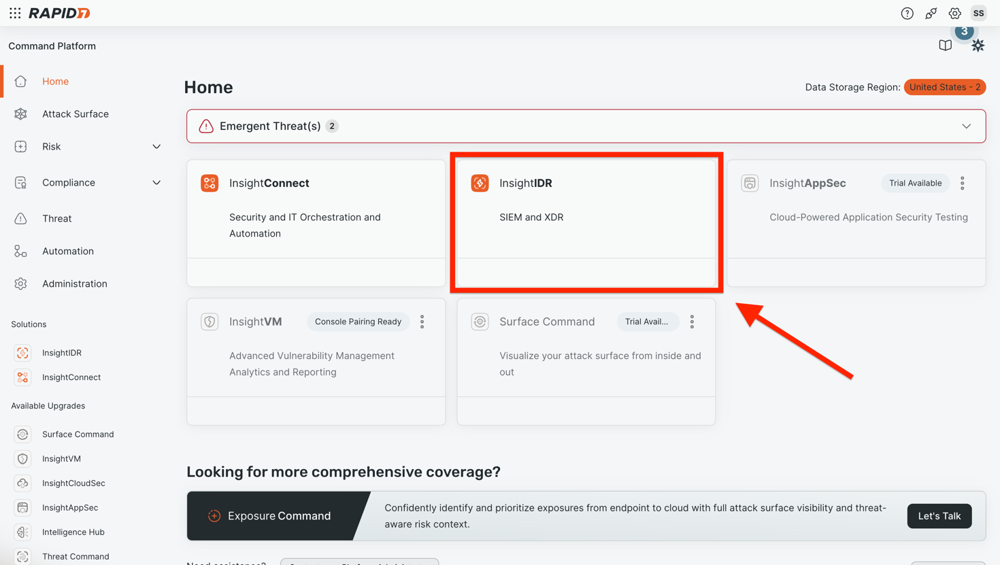
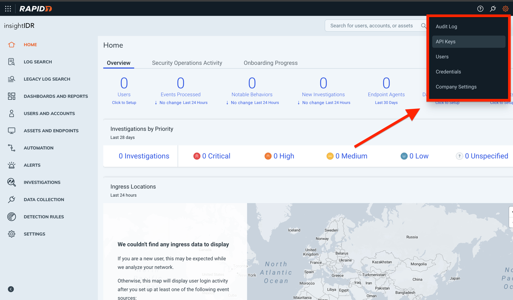
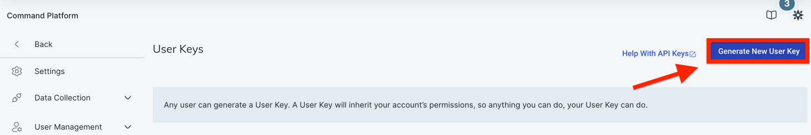
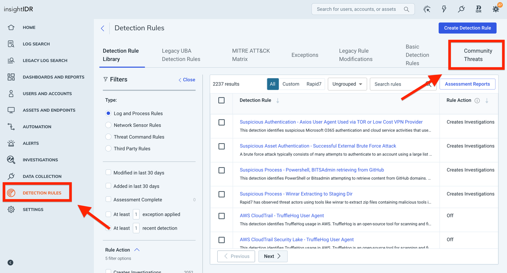
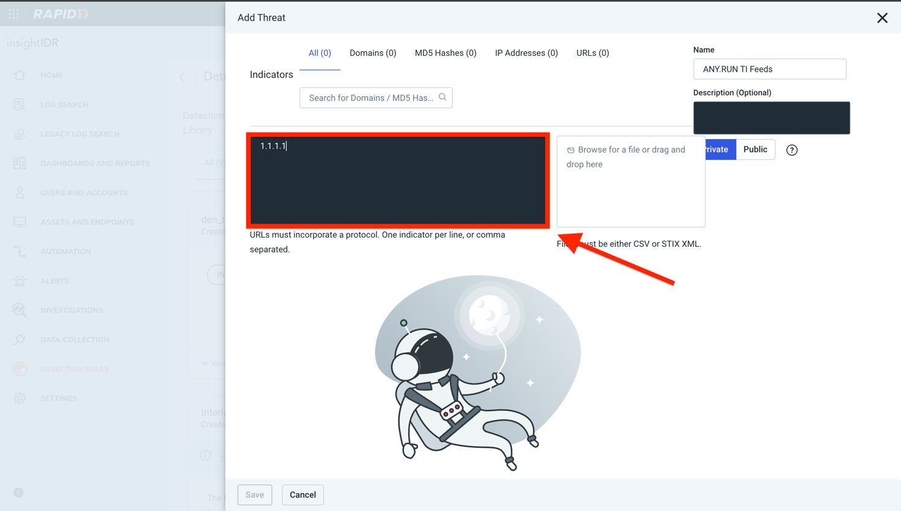
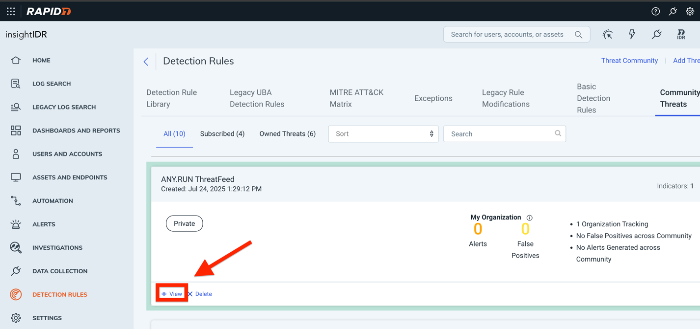
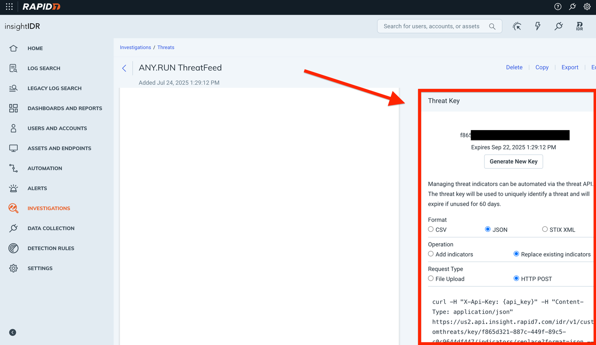

<p align="center">
    <a href="#readme">
        
    </a>
</p>

______________________________________________________________________

# ANY.RUN connector for Rapid7

This repository provides integrations of the Rapid7 platform with ANY.RUN Threat Intelligence Feeds.   
The TI feeds module supports scheduled ingestion of threat data from trusted providers.  
The connectors are Docker-ready, API-driven, and easy to configure.  

#  Installation Guide

#### Clone this project
```console
$ git clone git@github.com:anyrun/anyrun-integration-rapid7.git
```

#### Jump into the project directory
```console
$ cd anyrun-integration-rapid7
```

#### Create and fill the .env config. See "Setup secrets" and "Generate Basic Authentication token" sections below
```console
$ cp .env_example .env
```

#### Run the script using two of the following ways:
```console
$ docker-compose up --build
```
```console
$ python3 -m venv venv
$ source venv/bin/scripts/activate
$ pip install -r requirements.txt
$ python3 connector-anyrun-feed.py
```

#  Setup secrets

#### Follow InsightIDR product



#### Select Settings/API Keys


#### Generate a new API-Key


#### Use API-KEY as the value for the environment variable: RAPID7_API_KEY

#### Then follow Detection Rules/Community Threads


#### Create a new custom ThreatFeed with a temporary IOC


#### Select "View"


#### Then scroll down and configure the ThreatFeed API-Key with necessary permissions


#### Use API-KEY as the value for the environment variable: THREAT_FEED_ACCESS_KEY

## Generate Basic Authentication token

To obtain your Basic Authentication token, please contact your ANY.RUN account manager directly or fill out the request [form](https://any.run/demo/?utm_source=opencti_marketplace&utm_medium=integration&utm_campaign=opencti_form).

Use Basic Authentication token, as the value for the environment variable: ANYRUN_BASIC_TOKEN

## Support
This is an ANY.RUN supported connector. For support please contact <anyrun-integrations@any.run>