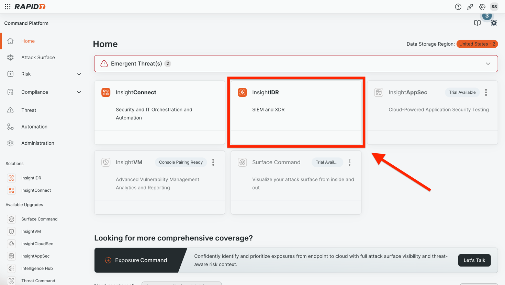
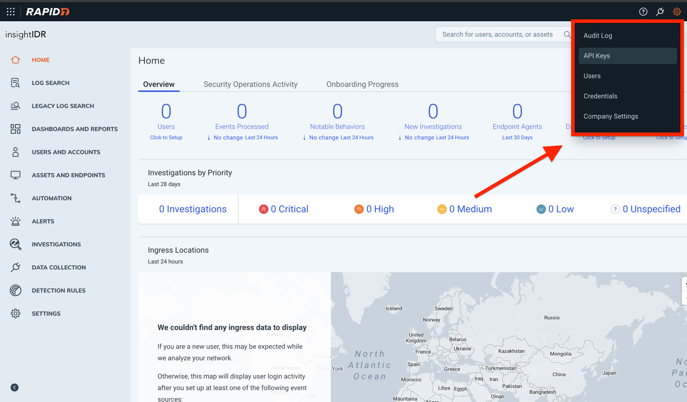
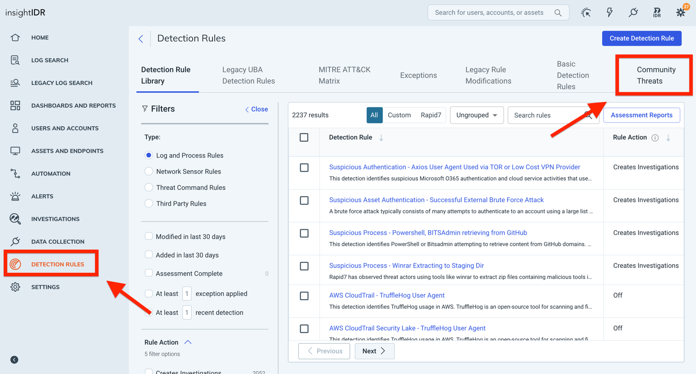
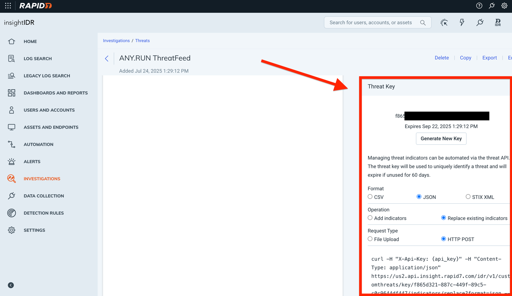

<p align="center">
    <a href="#readme">
        
    </a>
</p>

______________________________________________________________________

# ANY.RUN Threat Intelligence Feed Connector for Rapid7 InsightIDR

Connector delivers fresh, high-confidence IOCs directly from ANY.RUN’s interactive malware sandbox into InsightIDR Community Threats, empowering faster detection and response.

# Installation Guide
There are two ways to use the integration: Python and PowerShell script.

### Setup PowerShell script
Follow [this link](https://github.com/anyrun/anyrun-integration-rapid7/tree/main/anyrun-integration-insightidr-ti-feed/powershell)

### Setup Python script

#### Clone this project
```console
$ git clone git@github.com:anyrun/anyrun-integration-rapid7.git
```

#### Jump into the project directory
```console
$ cd anyrun-integration-rapid7/anyrun-integration-insightidr-ti-feed
```

#### Create and fill the .env config. See "Setup secrets" and "Generate Basic Authentication token" sections below
```console
$ cp .env_example .env
```

#### Run the script using two of the following ways:
```console
$ docker-compose up --build
```
```console
$ python3 -m venv venv
$ source venv/bin/scripts/activate
$ pip install -r requirements.txt
$ python3 connector-anyrun-feed.py
```

#  Setup secrets

#### Go to InsightIDR



#### Click the settings icon and choose API Keys in the dropdown menu 


#### Click Generate New User Key 


#### Use API-KEY as the value for the environment variable: RAPID7_API_KEY
Go to Detection Rules and find the Community Threads tab  

#### Then follow Detection Rules/Community Threads


#### Create a new custom ThreatFeed with a temporary IOC


#### Select "View"


#### Then scroll down and configure the ThreatFeed API-Key with necessary permissions


#### Use API-KEY as the value for the environment variable: THREAT_FEED_ACCESS_KEY

## Generate Basic Authentication token

To obtain your Basic Authentication token, please contact your ANY.RUN account manager directly or fill out the request [form](https://any.run/demo/?utm_source=opencti_marketplace&utm_medium=integration&utm_campaign=opencti_form).

Use Basic Authentication token as the value for the environment variable: ANYRUN_BASIC_TOKEN

## Support
This is an ANY.RUN supported connector. If you need help, contact <support@any.run>